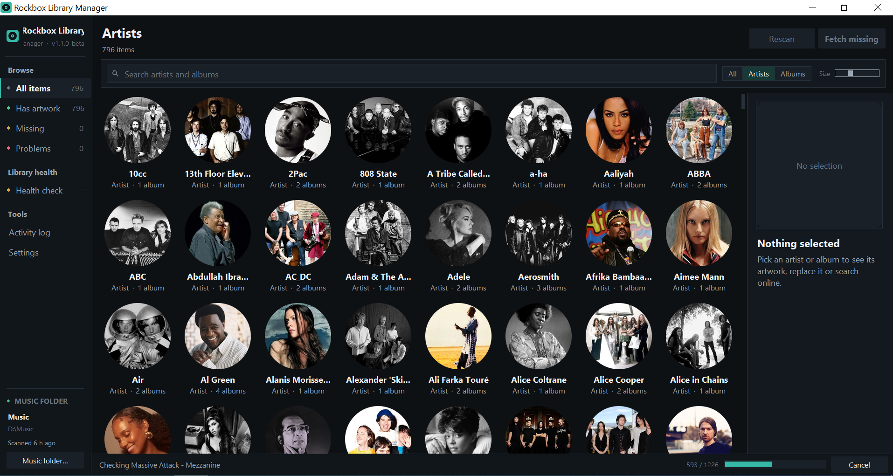
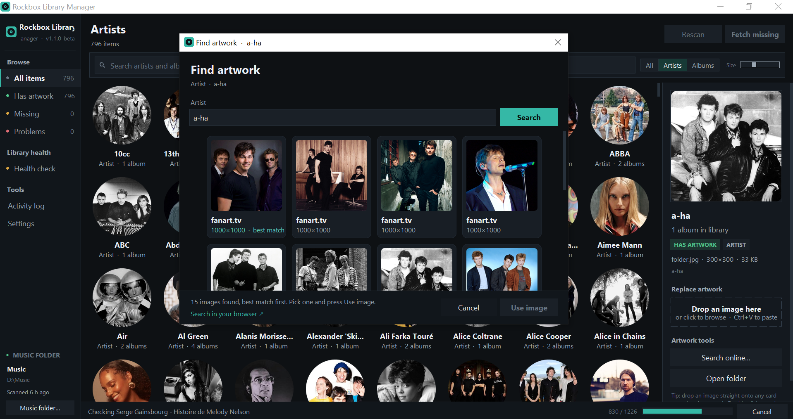

# Rockbox Library Manager

**A desktop companion tool built for [PodBox](https://github.com/anthonyfletcher/podbox).**
Browse your music library, manage artist and album artwork, check library health,
and edit album tags to prepare your library for use with PodBox.

## Credits and origins

Full credit for **PodBox and the original Rockbox Music Artwork Fetcher** goes to
[Anthony Fletcher (@anthonyfletcher)](https://github.com/anthonyfletcher).
This application grew out of his
[artwork tool](https://github.com/anthonyfletcher/podbox/tree/master/tools/art_fetch),
and its artwork engine is adapted from his
[`art_fetch.py`](https://github.com/anthonyfletcher/podbox/blob/master/tools/art_fetch/art_fetch.py).
His work is the foundation of this project.

Rockbox Library Manager was created specifically as a helper for PodBox, adding
a desktop interface and library-management tools around that foundation.
This companion application is maintained separately by
[cyberdeliaAI](https://github.com/cyberdeliaAI).

Thank you, Anthony, for creating PodBox and sharing the artwork tool that made
this application possible. See [CREDITS.md](CREDITS.md) for source references and
acknowledgements.

## License

This project is distributed under the **GNU General Public License, version 2
(GPL-2.0)**, following the license of the original PodBox source.
The full license is included in [LICENSE](LICENSE). See also
[PodBox's license declaration](https://github.com/anthonyfletcher/podbox#licence).

## Versions

**Version 1.0.0** is the first public release.

**Version 1.1.0-beta.2** includes a fix for PodBox's `/<HDD0>/Music/...` database
paths, including on Windows. It provides **Settings → Rockbox database…** for previewing tag
updates to an existing iPod index, making verified local backups and restoring
them. This is experimental until tested on the player; see the
[database update and recovery guide](docs/rockbox-database.md).

## Screenshots

Screenshots from version 1.1.0-beta.1 on Windows.

**Browse your music library** — explore artists and albums with their artwork.



**Find artwork** — search online and choose an image for an artist or album.



## Features

- Browse artists and albums with a local SQLite index and thumbnail cache.
- Find artwork online, extract embedded covers, or choose your own images.
- Write Rockbox-compatible baseline JPEG artwork as `folder.jpg`.
- Search artist names without worrying about case or accents.
- Check for duplicate artists, folder/tag mismatches, inconsistent album tags,
  and missing or unreadable tags.
- Resolve duplicate artists by merging their library entries, consolidating
  their folders, or keeping them separate.
- Edit selected album tags. Clearing a tag requires an explicit choice and
  confirmation.
- Use the same artwork engine from the command line.

## Install and run

Download the ZIP from [Releases](https://github.com/cyberdeliaAI/rockbox-library-manager/releases)
and extract it, or clone this repository. Open a terminal in the extracted folder.
Python 3.10 or later, including Tk, is required.

### Windows

Install Python 3.13 with Tcl/Tk support, then run:

```powershell
py -3.13 -m venv .venv
.venv\Scripts\python.exe -m pip install -r requirements.txt
.venv\Scripts\python.exe rockbox_library_manager.py
```

After installation, double-click `start_rockbox_library_manager.bat` to launch.

### macOS and Linux

Use a Python installation with Tk support. You can check it with
`python3 -m tkinter`; this should open a small test window. Some package managers
provide Tk as a separate package that must match your Python version.

```sh
python3 -m venv .venv
.venv/bin/python -m pip install -r requirements.txt
.venv/bin/python rockbox_library_manager.py
```

After installation, macOS users can double-click
`start_rockbox_library_manager.command`; Linux users can run
`./start_rockbox_library_manager.sh`. Both launchers use `.venv` when present.
If executable permissions were lost during extraction, run:

```sh
chmod +x start_rockbox_library_manager.command start_rockbox_library_manager.sh
```

The macOS/Linux launchers also accept `PYTHON_BIN` to select another interpreter.

### Optional drag and drop

Install `tkinterdnd2` with the same virtual environment's Python:

```sh
.venv/bin/python -m pip install tkinterdnd2
```

On Windows, use `.venv\Scripts\python.exe` instead.

## First use

1. Start the application and choose your music folder.
2. Scan the library to build the local index.
3. Browse artists and albums, then fetch missing artwork or select it manually.
4. Run Library Health when you want to inspect tags and artist identities.

Provider API keys can be configured in the application. Settings, credentials,
the library database and thumbnails are stored in the existing application-data
directory, so replacing the application folder does not reset them.

### Duplicate artists

Library Health offers three choices for names such as `Ali Farka Toure` and
`Ali Farka Touré`:

- **Merge in library** keeps both folders and shows one artist. Health remembers
  the decision.
- **Fix folders on disk** moves albums into the selected artist folder after
  confirmation. A conflict check prevents overwriting existing albums or files.
  Different artist images are retained under alternate filenames.
- **Keep separate** treats the names as different artists and remembers that
  choice.

Changing `ALBUMARTIST` during a folder merge is optional and off by default.
When a virtually merged artist has artwork in only one folder, Fetch Missing
first tries copying that artwork to its sibling folder.

Library Health only reads files during analysis. Folder repairs, artwork saves
and tag edits are explicit actions that can modify the selected music library.

## Command line

With your virtual environment activated:

```sh
python rockbox_library_manager.py --version
python -m rockbox_manager --help
python rockbox_library_manager.py artwork --help
python rockbox_library_manager.py artwork both "/path/to/Music"
```

On Windows, a music path might be `"E:\Music"`; on macOS, it might be
`"/Volumes/iPod/Music"`. The short form `both "/path/to/Music"` is also supported.

## Tests

The included tests exercise the real duplicate-resolution dialog using
temporary music folders, settings and databases. The silent FLAC fixture is
test data. No personal music library is needed.

With your virtual environment activated and a working Tk display:

```sh
python -m unittest discover -s tests -v
```

On headless Linux with Xvfb installed:

```sh
xvfb-run -a -s "-screen 0 1920x1200x24" python -m unittest discover -s tests -v
```

Checks cover dialog controls, scaling, font roles, remembered identity choices,
merge confirmation, preservation of files and artwork, and album-name conflicts.

## Project layout

- `rockbox_library_manager.py`: application entry point.
- `rockbox_manager/gui.py`: desktop UI, Library Health and tag editor.
- `rockbox_manager/artwork_engine.py`: artwork lookup and image processing.
- `rockbox_manager/launcher.py`: GUI and command-line dispatch.
- `tests/`: duplicate-resolution regression tests.
