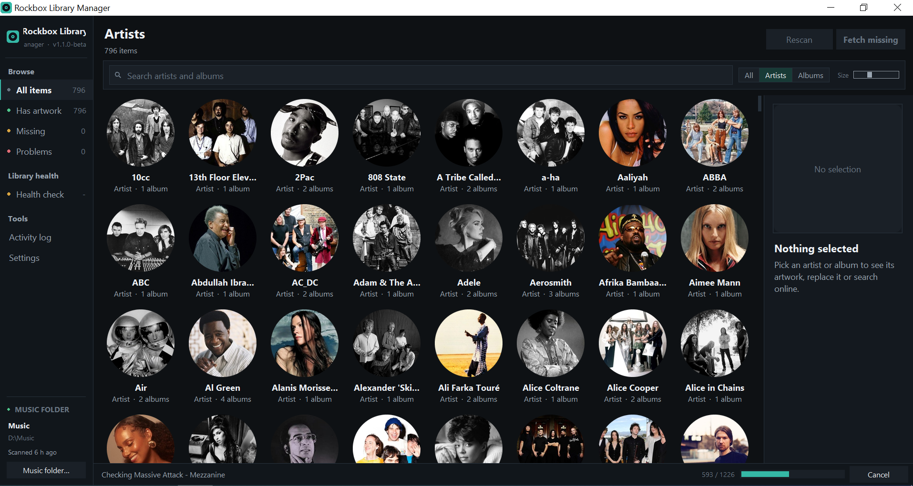
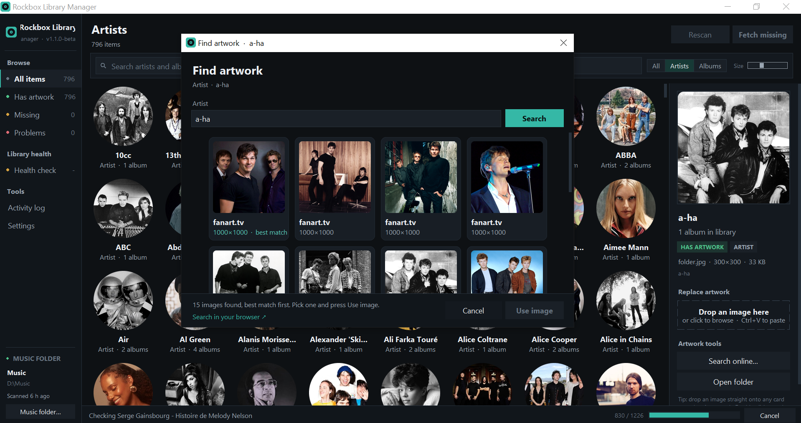

# Rockbox Library Manager

**A desktop companion tool built for [PodBox](https://github.com/anthonyfletcher/podbox).**
Browse your music library, manage artist and album artwork, check library health,
and edit album tags to prepare your library for use with PodBox.

## Credits and origins

Full credit for **PodBox and the original Rockbox Music Artwork Fetcher** goes to
[Anthony Fletcher (@anthonyfletcher)](https://github.com/anthonyfletcher).
This application grew out of his
[artwork tool](https://github.com/anthonyfletcher/podbox/tree/master/tools/art_fetch),
and its artwork engine is adapted from his
[`art_fetch.py`](https://github.com/anthonyfletcher/podbox/blob/master/tools/art_fetch/art_fetch.py).
His work is the foundation of this project.

Rockbox Library Manager was created specifically as a helper for PodBox, adding
a desktop interface and library-management tools around that foundation.
This companion application is maintained separately by
[cyberdeliaAI](https://github.com/cyberdeliaAI).

Thank you, Anthony, for creating PodBox and sharing the artwork tool that made
this application possible. See [CREDITS.md](CREDITS.md) for source references and
acknowledgements.

## License

This project is distributed under the **GNU General Public License, version 2
(GPL-2.0)**, following the license of the original PodBox source.
The full license is included in [LICENSE](LICENSE). See also
[PodBox's license declaration](https://github.com/anthonyfletcher/podbox#licence).

## Versions

**Version 1.2.0-beta.1** adds **Settings → Prepare media for PodBox → Scan and
prepare…**: scan hi-res FLAC, resize oversized artwork to your configured size,
and find larger sources for undersized artwork. Original media backups are
enabled by default and can be disabled in Settings. FLAC conversion requires
FFmpeg. **Choose folder…** lets you inspect just a known problem folder instead
of the full library. See the [media preparation guide](docs/media-preparation.md).

**Version 1.0.0** is the first public release.

**Version 1.1.0** includes a fix for PodBox's `/<HDD0>/Music/...` database
paths, including on Windows. It provides **Settings → Rockbox database…** for previewing tag
updates to an existing iPod index, making verified local backups and restoring
them. This is experimental until tested on the player; see the
[database update and recovery guide](docs/rockbox-database.md).

## Screenshots

Screenshots from version 1.1.0-beta.1 on Windows.

**Browse your music library** — explore artists and albums with their artwork.



**Find artwork** — search online and choose an image for an artist or album.



## Features

- Browse artists and albums with a local SQLite index and thumbnail cache.
- Find artwork online, extract embedded covers, or choose your own images.
  Cover Art Archive, Deezer, Apple Music and TheAudioDB work without a key;
  Last.fm, fanart.tv and Discogs add more with a key.
- Write Rockbox-compatible baseline JPEG artwork as `folder.jpg`.
- Search artist names without worrying about case or accents.
- Check for duplicate artists, folder/tag mismatches, inconsistent album tags,
  and missing or unreadable tags.
- Resolve duplicate artists by merging their library entries, consolidating
  their folders, or keeping them separate.
- Check for tags that block the Rockbox database update (several values in one
  tag, unreadable years), combined genre text such as `Pop;Rock`, genre spellings
  Rockbox lists separately (`Hip Hop` / `Hip-Hop`), and missing years, genres and
  track numbers.
- Edit selected album tags with online suggestions for the year and genre, and
  review every change before it is saved. Clearing a tag requires an explicit
  choice and confirmation.
- Scan FLAC headers and artwork dimensions with a local cache, then convert
  selected hi-res FLAC to 16-bit / up to 44.1 kHz, resize large artwork, or
  rewrite progressive JPEG artwork (which Rockbox can't show) as baseline JPEG.
- Replace artwork smaller than the configured size with a larger online source,
  or open the artwork search to choose one; small images are never upscaled.
- Use the same artwork engine from the command line.

## Install and run

Download the ZIP from [Releases](https://github.com/cyberdeliaAI/rockbox-library-manager/releases)
and extract it, or clone this repository. Open a terminal in the extracted folder.
Python 3.10 or later, including Tk, is required.

### Windows

Install Python 3.13 with Tcl/Tk support, then run:

```powershell
py -3.13 -m venv .venv
.venv\Scripts\python.exe -m pip install -r requirements.txt
.venv\Scripts\python.exe rockbox_library_manager.py
```

After installation, double-click `start_rockbox_library_manager.bat` to launch.

### macOS and Linux

Use a Python installation with Tk support. You can check it with
`python3 -m tkinter`; this should open a small test window. Some package managers
provide Tk as a separate package that must match your Python version.

```sh
python3 -m venv .venv
.venv/bin/python -m pip install -r requirements.txt
.venv/bin/python rockbox_library_manager.py
```

After installation, macOS users can double-click
`start_rockbox_library_manager.command`; Linux users can run
`./start_rockbox_library_manager.sh`. Both launchers use `.venv` when present.
If executable permissions were lost during extraction, run:

```sh
chmod +x start_rockbox_library_manager.command start_rockbox_library_manager.sh
```

The macOS/Linux launchers also accept `PYTHON_BIN` to select another interpreter.

### Optional drag and drop

Install `tkinterdnd2` with the same virtual environment's Python:

```sh
.venv/bin/python -m pip install tkinterdnd2
```

On Windows, use `.venv\Scripts\python.exe` instead.

## First use

1. Start the application and choose your music folder.
2. Scan the library to build the local index.
3. Browse artists and albums, then fetch missing artwork or select it manually.
4. Run Library Health when you want to inspect tags and artist identities.

Provider API keys can be configured in the application. Settings, credentials,
the library database and thumbnails are stored in the existing application-data
directory, so replacing the application folder does not reset them.

### Online sources and keys

| Source | Used for | Key |
|---|---|---|
| MusicBrainz + Cover Art Archive | Covers, first-release year, genres | None |
| Deezer | Covers (1000 px), artist pictures, year and genres | None |
| Apple Music (iTunes Search) | Covers (1200 px), year and genre | None |
| TheAudioDB | Covers, artist pictures, year and genres | None (public key) |
| Last.fm | Covers, artist pictures, listener tags as genres | API key: [last.fm/api/account/create](https://www.last.fm/api/account/create) |
| fanart.tv | Artist pictures | Personal API key: [fanart.tv/get-an-api-key](https://fanart.tv/get-an-api-key/) |
| Discogs | Covers, artist pictures, original year and styles | Personal token: Discogs → Settings → Developers |

Enter keys in **Settings → Online sources**. They are stored in
`artist_art_credentials.json` in the application-data directory (on macOS and
Linux readable by your account only). The Last.fm shared secret is not needed; an older saved
secret is removed the next time settings are saved.

Searches leave out edition text such as `(2018 Remaster)` or `- Deluxe Edition`
and ignore case, accents and a leading "The". Automatic fetches only use a cover
from Cover Art Archive, Deezer, Apple Music or Discogs when artist and album
match closely (85%); **Search online** also shows nearer misses so you can
choose. Requests are spaced per source (MusicBrainz once
a second, Apple Music every 3 seconds) across the whole application.

### Library Health

**Analyze library** reads three tracks per album (first, middle and last) so a
scan of a slow iPod disk stays short. Tick **Check every track (slower)** to read
them all, which also finds duplicate track numbers and problems in the middle of
an album. The filters group the results:

- **Duplicates**: artist folders that differ only in accents, case or punctuation.
- **Tags**: folder names that don't match the tags, albums whose tracks disagree,
  and missing or unreadable tags.
- **Database**: several values in one tag (for example two `GENRE` fields) and
  years such as `c. 1982`. Rockbox keeps one value per tag, and
  **Settings → Rockbox database…** stops at these files until they are fixed.
- **Genres**: combined text such as `Pop;Rock`, which Rockbox lists as a genre of
  its own, and spellings it lists separately (`Hip Hop` next to `Hip-Hop`; case
  differences are already merged by Rockbox).
- **Missing info**: no year, no genre, or missing or duplicate track numbers.

Select an album issue and choose **Edit tags…** to fix it.

### Editing album tags

The tag editor shows every value a track has. Tick the fields to change; a
saved field gets exactly one value on every track. **Find year and genre**
searches the online sources and lists their years and genres; click one to put
it in the form. MusicBrainz and Discogs give the first-release year, Deezer and
Apple Music the date of their edition (for a remaster, the remaster's date).
Years must be `YYYY`, `YYYY-MM` or `YYYY-MM-DD`.

**Review and save…** lists the changes before anything is written, with identical
changes grouped (for example `Genre: “Pop;Rock” → “Pop” · 12 tracks`). Tracks that
already have the new values are not rewritten.

### Duplicate artists

Library Health offers three choices for names such as `Ali Farka Toure` and
`Ali Farka Touré`:

- **Merge in library** keeps both folders and shows one artist. Health remembers
  the decision.
- **Fix folders on disk** moves albums into the selected artist folder after
  confirmation. A conflict check prevents overwriting existing albums or files.
  Different artist images are retained under alternate filenames.
- **Keep separate** treats the names as different artists and remembers that
  choice.

Changing `ALBUMARTIST` during a folder merge is optional and off by default.
When a virtually merged artist has artwork in only one folder, Fetch Missing
first tries copying that artwork to its sibling folder.

Library Health only reads files during analysis. Folder repairs, artwork saves
and tag edits are explicit actions that can modify the selected music library.

## Command line

With your virtual environment activated:

```sh
python rockbox_library_manager.py --version
python -m rockbox_manager --help
python rockbox_library_manager.py artwork --help
python rockbox_library_manager.py artwork both "/path/to/Music"
```

Installing the folder as a package (`python -m pip install -e .`) also provides a
`rockbox-library-manager` command with the same options.

On Windows, a music path might be `"E:\Music"`; on macOS, it might be
`"/Volumes/iPod/Music"`. The short form `both "/path/to/Music"` is also supported.

## Tests

The tests use temporary music folders, settings and databases, and exercise the
real Tk dialogs. Online sources are tested with recorded answers, so no network
is needed. The silent FLAC fixture is test data. No personal music library is
needed.

With your virtual environment activated and a working Tk display:

```sh
python -m unittest discover -s tests -v
```

On headless Linux with Xvfb installed:

```sh
xvfb-run -a -s "-screen 0 1920x1200x24" python -m unittest discover -s tests -v
```

Checks cover dialog controls, scaling, font roles, remembered identity choices,
merge confirmation, preservation of files and artwork, album-name conflicts,
online-source parsing and matching, the tag editor's review and single-value
writes, and every Library Health check.
Media tests also exercise cached scans, actual FFmpeg conversion, metadata and
cover preservation, backup choices, cancellation, stale previews and damaged
input. Install FFmpeg on PATH to run the audio integration tests; those tests
are skipped when it is absent. Windows CI installs FFmpeg and runs them.

Lint with [ruff](https://docs.astral.sh/ruff/) (`pip install ruff`):

```sh
ruff check rockbox_manager tests
```

The GitHub workflow runs the tests on Windows, macOS and Linux with Python 3.10
and 3.13; FFmpeg is installed on Windows and Linux for the conversion tests.

## Project layout

- `rockbox_library_manager.py`: application entry point.
- `rockbox_manager/launcher.py`: GUI and command-line dispatch.
- `rockbox_manager/gui.py`: main window, library browser, settings and activity log.
- `rockbox_manager/library.py`: SQLite library index and the fast folder scanner.
- `rockbox_manager/health.py`: Library Health checks.
- `rockbox_manager/tags.py`: reading, planning and writing tags (no UI).
- `rockbox_manager/tag_editor.py`: album tag editor with online suggestions and review.
- `rockbox_manager/picker.py`: online artwork picker.
- `rockbox_manager/folders.py`: consolidating duplicate artist folders on disk.
- `rockbox_manager/artwork_engine.py`: artwork lookup, scoring and image processing.
- `rockbox_manager/sources.py`: online metadata sources (adapted from Tagcast).
- `rockbox_manager/media_tools.py`: cached inspection and verified media replacement.
- `rockbox_manager/media_dialog.py`: media selection, conversion and resizing UI.
- `rockbox_manager/rockbox_database.py`: Rockbox database (TCH v16) updates and backups.
- `rockbox_manager/database_dialog.py`: database preview, backup and restore UI.
- `rockbox_manager/common.py`, `ui_theme.py`, `widgets.py`: shared helpers, theme and widgets.
- `tests/`: unit and dialog tests.
